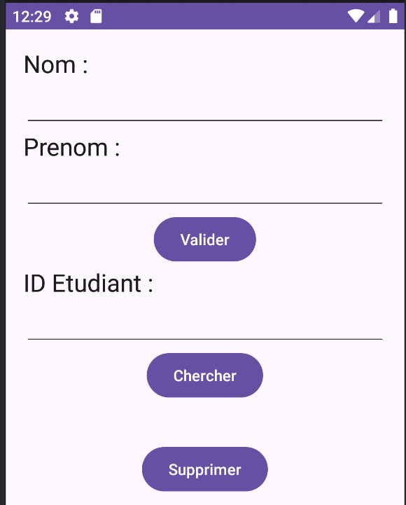
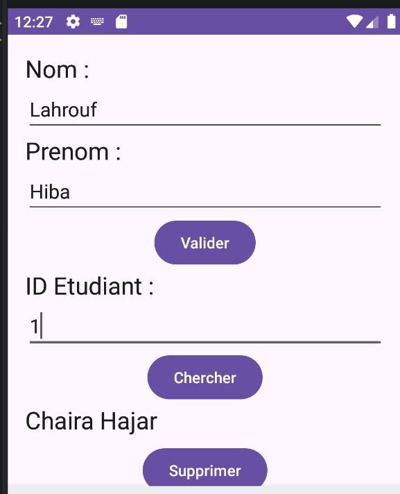

# LAB 15 - Persistance locale des données : SQLite et Android
**Cours :** Programmation Mobile : Android avec Java  
**Étudiant :** Hajar Chaira

---

## 1. Objectif 
L'objectif de ce laboratoire est de réaliser une application Android autonome intégrant une base de données embarquée SQLite. L'application permet d'assurer le stockage local et la persistance des données relatives aux étudiants. Elle met en œuvre le schéma classique du cycle CRUD (création, recherche, affichage et suppression) entièrement hors-ligne, directement sur le support de stockage du périphérique mobile, à travers une architecture applicative propre et structurée en couches.

---

## 2. Aperçu visuel du projet et Démonstration

### Captures d'écran de l'exécution du projet

| Lapplication  | Ajout d'étudiant et Recherche d'étudiant | 
| :---: | :---: |
|  |  | 

---

## 3. Démonstration Vidéo
La vidéo ci-dessous présente le fonctionnement de l'application en temps réel : l'ajout d'étudiants via le formulaire, la recherche instantanée de leurs fiches par identifiant unique et la suppression réussie des enregistrements de la base de données SQLite locale.

<video src="img-lab15-dev/video.mp4" controls="controls" style="max-width: 100%;">
</video>

---

## 4. Architecture et Réalisation minimale

### Étape 1 : Modélisation Métier
Une structure de classe simple a été créée pour représenter les entités stockées. L'objet comprend des attributs distincts pour l'identifiant unique (clé primaire auto-incrémentée par SQLite), le nom et le prénom, associés à des accesseurs standards.

### Étape 2 : Création de la Base de données (SQLiteOpenHelper)
Un gestionnaire de base de données dérivé de la classe Android native de persistance initialise le fichier de stockage nommé de façon autonome. Il s'occupe de la construction automatique de la table locale à l'initialisation de l'application et de sa mise à niveau en cas de restructuration du schéma SQL.

### Étape 3 : Implémentation du Service d'Accès aux Données
Un service intermédiaire encapsule la logique d'interrogation de la base de données SQLite :
* **Écriture :** Enregistre les nouveaux champs de données par le biais de structures de valeurs normalisées.
* **Lecture :** Exécute des sélections ciblées sur des tables à l'aide de curseurs de parcours afin de reconstituer les objets métier de manière asynchrone.
* **Mise à jour et Suppression :** Gère la suppression des lignes correspondantes selon l'identifiant fourni.

### Étape 4 : Interface et Gestion des Événements
L'interface graphique est agencée verticalement dans un modèle de conteneur linéaire simple. Elle réunit des zones de texte guidées et des champs d'édition pour la saisie, associés à des déclencheurs d'événements. Les écouteurs d'événements valident les entrées utilisateurs, exécutent les transactions en base de données SQLite via le service dédié et informent l'utilisateur par des messages d'alerte temporaires.

---

